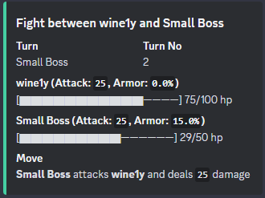
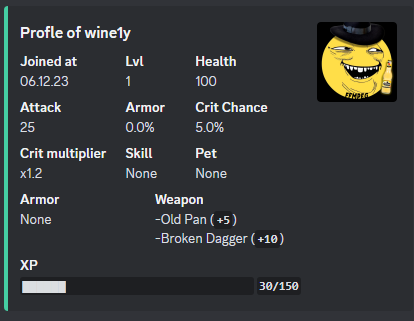

# Bosscord

Discord rpg bot where you can fight bosses, buy new equipment and participate in PVP fights.

# Features
- Autoplay fights (no actions required)
- Reward roles for boss fights and levels
- UnbelievaBoat balance integration
- Easy customization (you can edit bosses, items and localizations with json configs)

# Configuring
- use **config.json** to configure the bot
  - **DB_URL** - Url of the database
  - **WORKING_GUILDS** - List of guild ids in which the bot will work
  - **BOT_TOKEN** - Discord bot token
  - **UNB_BOT_TOKEN** - Unb API token
  - **CURRENCY_SYMBOL** - Symbol representing bot's currency
  - **START_STATS** - Starting player stats
  - **MAX_LVL** - Maximum available level
  - **LVLS** - List of levels (their requirements and reward roles)
  - **PVP_XP_REWARD** - XP reward for winning a pvp battle
  - **TURN_DELAY** - Battle turn delay in seconds
  - **MOVE_DELAY** - Battle move delay in seconds (multiple moves can be made in one turn)
  - **ITEMS_PATH** - Path to items.json
  - **TEXTS_PATH** - Path to texts.json
  - **BOSSES_PATH** - Path to bosses.json
  
- use **items.json** to configure items
    - **skills** - List of skill and their properties
    - **pets** - List of pets and their properties
    - **armors** - List of armor elements and their properties
    - **weapons** - List of weapons and their properties
- use **texts.json** to configure localizations
  - **COMMAND_DESCRIPTIONS** - List of slash-command descriptions
  - **EMBED_MESSAGES** - List of Discord-embed and their properties
  - **ERRORS** - List of error texts
  - **SIMPLE_MESSAGES** - List of message texts
- use **bosses.json** to configure bosses

# Deployment
  1. Configure your bot (more in Configuring section)
  2. Make sure you have authorized your bot in UNB API
  3. Use Docker to deploy the bot

# Screenshots

  
  

